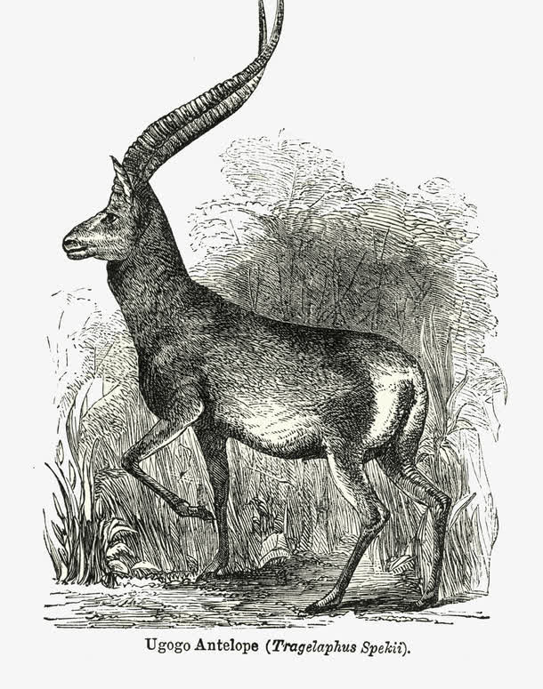
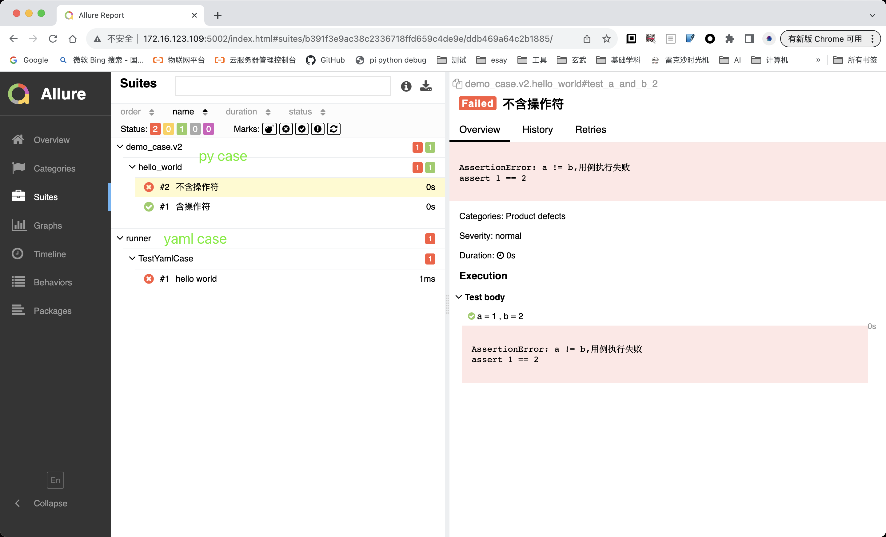

### 前言

Antelope(羚羊)自动化测试框架是一个基于`pytest`的自动化测试框架。使用者可以在这个框架下使用 python 的原生测试用例和本框架支持的`yaml`格式的自动化测试脚本，以便于团队中处于不同编码阶段的测试人员，都能共同构筑自动化测试。

框架设计之初，主要是为了解决接口自动化的具体问题，所以`yaml`用例中有一些包含`api`、`request`字眼的关键字，后续我们会着手于 UI 自动化，丰富我们的内置步骤。

开发环境默认都是在`MacOS`和`vscode`上进行，对于`Pycharm`和`Windows`的适配都十分有限，所以一些快捷工具可能会失效，但是不会影响我们正常使用框架。

P.S. 下方的链接优先使用`github`，但是国内的人员可以使用`gitee`替代

### 安装

1、请先拉取[仓库](https://github.com/JoeEmp/antelope)

2、按照仓库内 readme 的操作,并初始化我们的环境。

3、安装 allure 测试报告框架

4、运行`python3 regression_test.py`,确保我们的环境安装正确

### 快速开始

下面有这样的目录结构及文件内容

```
demo_case
  - v2
    - hello_world
        - hello_world_template.yaml
        - hello_world_value.yaml
    - hello_world.py
runner.py
```

hello_world_template.yaml 内容如下

```yaml
_version: 2.0

case:
  title: "hello world"
  test_step:
    - set_by_json: { "a": 2, "b": 3 }
    - assertEqual:
        first: ${a}
        second: ${b}
        msg: a != b,用例执行失败
```

hello_world.py 内容如下

```python
import allure

@allure.title('含操作符')
def test_a_and_b():
    with allure.step('a = 1+1 , b = 2'):
        a , b = 1+1 , 2
    assert a == b , 'a != b,用例执行失败'

@allure.title('不含操作符')
def test_a_and_b_2():
    with allure.step('a = 1 , b = 2'):
        a , b = 1 , 2
    assert a == b , 'a != b,用例执行失败'
```

执行下面命令行，执行用例

```bash
python3 runner.py demo_case/v2
```

allure 报告如下


### 更多内容

- [为项目初始化](md/init_your_project.md)
- [yaml 用例介绍](md/function.md)
- [内置步骤介绍](md/steps.md)
- [小工具](md/tools.md)
