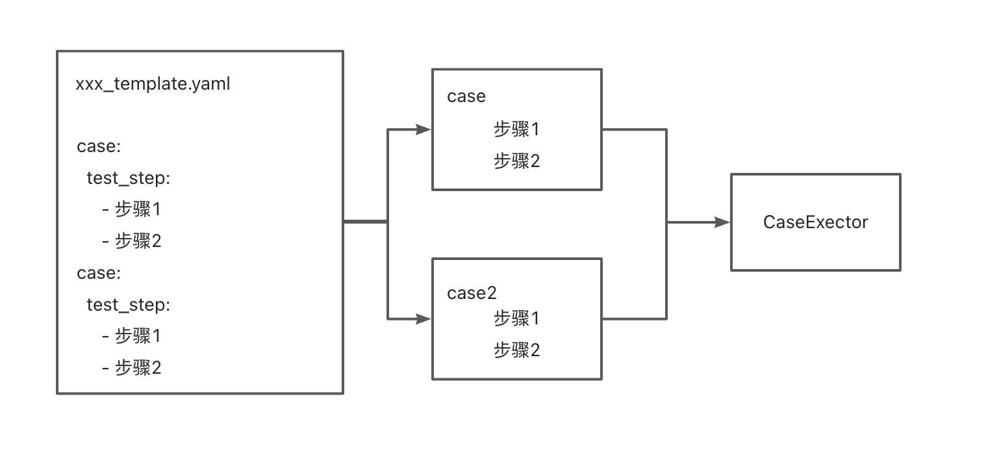
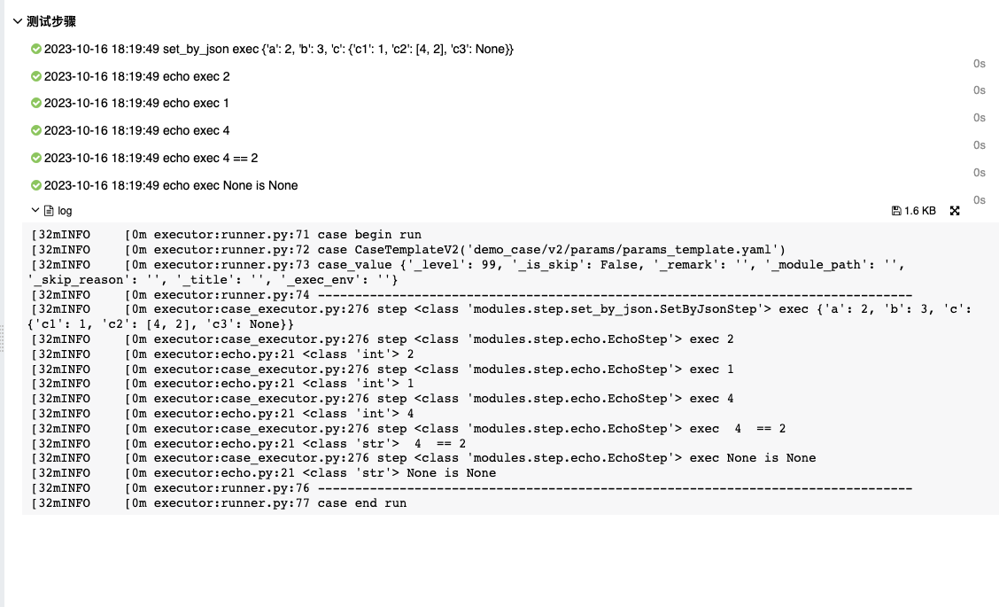
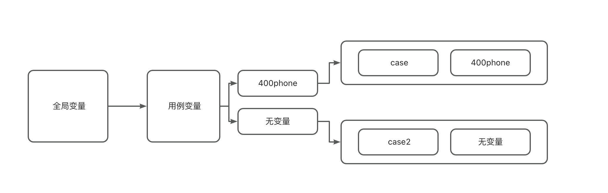

### 如何执行

```bash
# 使用文件夹
python runner.py dirname
# 指定某个文件
python runner.py yaml_file
# 指定python文件
python runner.py py_file
```

1、在开始执行前,程序会开始遍历指定目录下所有 xxx_template.yaml 文件,和所有 python 文件或是某个文件

2、xxx_template.yaml 会查找 xxx_value.yaml 文件作为自己的局部变量，找不到的情况下会生成一个空的全局变量

3、用例转换为一个个可执行步骤，然后执行。



### 用例语法

用例的形式`BDD`(Behavior Driven Development)的`step by step`风格，用例编写起来会更加简单。一个文件中会有多个用例且用例都以 case 为开头 。test_step 是一个必填数组,里面供我们放入步骤去执行。内置基础步骤有变量设置、断言、数据查询、接口请求等，步骤有很多，详见[步骤列表](steps.md)。

```yaml
_version: 2.0

# 第一个用例
case:
  test_step:
    # 多个步骤
    - set_by_json: { "a": 2, "b": 3 }
    - assertEqual:
        first: ${a}
        second: ${b}
        msg: a != b,用例执行失败
# 第二个用例
case2: ...
```

下面是用例的可选参数
|字段|使用|
|-|-|
|level|用例优先级,默认为 DEF_LEVEL|
|is_skip|是否跳过默认为False|
|skip_reason|跳过是展示原因|
|remark|备注，用于allure的description|
|module_path|模块，用于allure的story 和 tag|
|title|allure的用例标题|
|exec_env|str或者是list,指定用例可执行的环境|


### cli的功能选项

- 文件或者目录，运行指定的文件/目录的用例。
- -e 环境，用户指定用例变量的环境。
- -num，统计指定目录下的用例数量,只会统计不做执行
- -g 环境变量的文件名，默认文件名为 GLOBAL_VALUE_FILENAME
- -t，测试用例的语法错误和配置项缺失警告(未实现)
- -suite，运行某个测试套件

辅助用户使用不同的组合去执行用例，使用则执行指定suite文件的用例，减少回归用例时间。当同时指定case_file和suite，会优先使用suite。

- -level 优先级，指定运行小于改优先级的用例,默认值为DEF_LEVEL
- --reruns 失败用例重跑次数
- --reruns_delay，重跑的间隔时间，单位为秒
- -version 版本针对不同版本有不同的用例(暂未实现)
- -debug 调试模式，会打印debug等级的日志，同时日志将追加打印在debug.log文件

### 变量参数化

antlope 中参数化的方式为`${xxx}`(旧有v1用例支持`{xxx}`,但是已经废弃不在支持),我们在执行的过程中变量都可以通过这个方式引用,同时也支持`jsonpath`去引用。在单独使用参数化，参数最终会转化为实际值，如果参数在字符串内的情况下,参数始终以`str(xxx)`的形式出现。c3 的引用就是如此。

```yaml
_version: 2.0

# 第一个用例
case:
  test_step:
    - set_by_json:
        { "a": 2, "b": 3, "c": { "c1": 1, "c2": [4, 2], "c3": null },"d":[1,32,"456"] }
    - echo: "${a}"
    - echo: "${c}.c1"
    - echo: "${c}.c2.0"
    - echo: " ${c}.c2.0  == ${c}.c2.1 "
    - echo: "${c}.c3 is None"
```



### 全局变量

全局变量从`GLOBAL_VALUE_FILENAME`中读取，他是是方便我们定义通用的变量,它本身也是`yaml`文件,使用根节点来作为环境，我们使用`-e`去运行,在不指定环境的情况下默认返回`{}`。全局变量不同于局部变量，一些数据链接、oss链接都会在初始全部变量时生成，这一内容在[开发文档-自定义数据链接]()详细说明

global_value.yaml 如下

```yaml
demo: { "admin_phone": "135" }
dev: { 
    "admin_phone": "189" 
    db:
      mysql:
        host: "127.0.0.1"
        port: 3306
        username: "root"
        pwd: a123456
        dbname: "dev"
        type: mysql
    }
```

demo_template.yaml

```yaml
case:
  test_step:
    - echo: "${admin_phone}"
```

指定环境执行

```bash
python3 demo_template.yaml -e demo
python3 demo_template.yaml -e dev
```

### 用例变量、局部变量

用例变量和全部变量相似，使用根节点来作为环境，同时需要一个二级节点和use_value配合使用,用例变量和全局变量组合成全局变量(用例变量>全局变量),在没有找到时则使用全局变量生成局部变量。




demo_template.yaml
```yaml
case:
  use_value: 400phone
  title: 400电话
  test_step:
    - echo: "${admin_phone}"

case2:
  title: 个人电话
  test_step:
    - echo: "${admin_phone}"
```

demo_value.yaml
```yaml
demo: {
    "400phone": {"admin_phone": "400-99999" }
}
```


### 步骤

用例中步骤是重要组成部分，无论我们的前置步骤、后置步骤、断言都是步骤。步骤的形式十分简单，仍是json的的基础类型，形式如下：
```
步骤1: 1.0
步骤2: ''
步骤3:
  参数1: 'aaa'
  参数2: 'aaa'
步骤4:
  - a
  - b
```
参数的形式是断言自己决定的，并不是恒定不变的大部分断言步骤都是支持数组和对象入参
```python
class AssertStep(metaclass=ABCMeta):
    """各类断言步骤(基本可以照抄unittest)"""

    def __init__(self, paramers, *args, **kwargs):
        self.unzip_paramers(paramers)

    ...
    
    def unzip_paramers(self, paramers):
        if isinstance(paramers, list):
            self.set_args(paramers)
        elif isinstance(paramers, dict):
            self.set_kwargs(paramers)

    def set_kwargs(self, paramers: dict):
        for k, v in paramers.items():
            setattr(self, k, v)

    @abstractmethod
    def set_args(self, args: list):
        pass

    ...


class AssertEqualStep(AssertStep):
    """断言str(first)和str(second)相等"""

    def set_args(self, args):
        self.first, self.second, self.msg, *_ = args
        self.first, self.second = str(self.first), str(self.second)

    def execute(self):
        assert self.first == self.second, self.msg

    @classmethod
    def snippet(self):
        return """
        - assertEqual:
            first:
            second:
            msg:
        """, self. __doc__
```
步骤允许这样的使用
```yaml
case:
  test_step:
    # 步骤推荐写法
    - assertEqual:
        first: 1
        second: 1
        msg: "a != b"
    # 步骤兼容写法
    - assertEqual:
        - 1
        - 1
        - "a != b"
    - echo: after 1 sec, case end
    - sleep: 1
```


### 断言

在框架中断言不会中断用例执行，在执行的过程中如果遇到失败，框架会记录下断言的异常信息。


如果你希望严格执行可在`modules/case_executor.py`的`execute_step`注释掉`run_with_assert`装饰器
```python
@run_with_assert
def execute_step(self, step_class, step_args):
  ...
```
