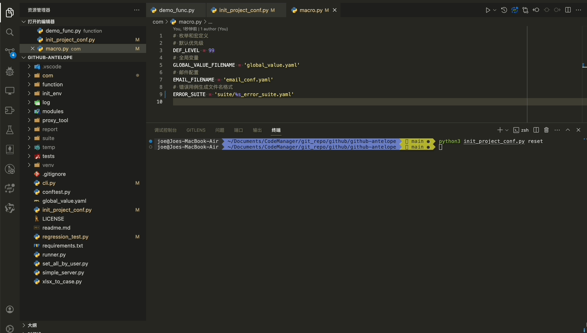
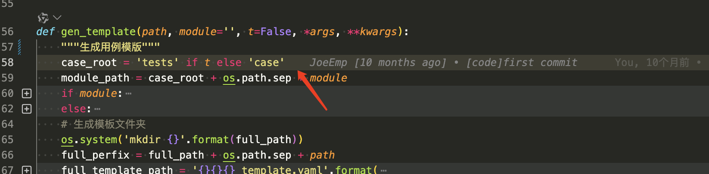

由于各个配置的不同，框架提供配置初始化的脚手架来方便配置环境

```bash
python3 init_project_conf.py ipc {project_name}
```

假设{project_name}为 shop，我们会生成 shop_case 的文件夹，里面包含邮件配置文件，数据库配置文件，框架运行时也会引用这两个文件，而不是一级目录下的两个配置文件。同时 cli.py 生成的用例模版也会默认建在 shop_case 的文件夹下。
如果你不需要使用生成的文件，则输入 n 拒绝即可。



如果你需要环境`com/marco.py`的配置则使用`reset`即可

```
python3 init_project_conf.py reset
```

需要注意的是，reset 成功我们仍需手动修改`cli.py`的生成模版方法


